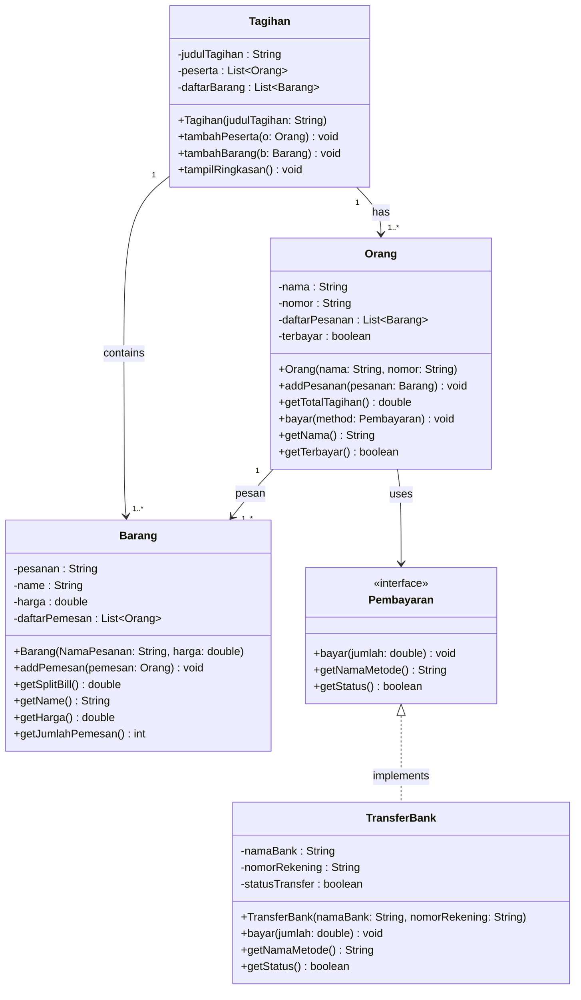
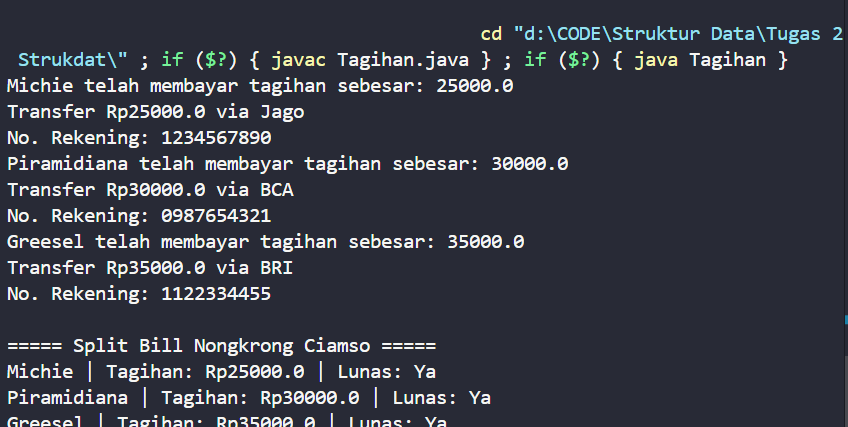

# 💸 Split Bill — Sistem Pembagian Tagihan Bersama

**Nama:** Dian Piramidiana Rachmatika  
**NRP:** 5027251031  
**Mata Kuliah:** Struktur Data & OOP  

---

## 📋 Deskripsi Kasus

Pernahkah kamu nongkrong bareng teman tapi bingung siapa bayar apa? Masalah ini sangat umum terjadi di kehidupan sehari-hari mahasiswa — makan bersama, patungan jajan, atau nongkrong di kafe.

**Split Bill** adalah sistem pembagian tagihan yang memungkinkan setiap orang membayar sesuai pesanan masing-masing. Jika satu item dipesan bersama, harganya akan dibagi rata di antara pemesan. Pembayaran dilakukan melalui transfer bank.

**Contoh skenario:**
- Michie memesan Thai Tea (Rp25.000)
- Piramidiana memesan Nasi Hainan (Rp30.000)
- Greesel memesan Nasi Goreng Carbonara (Rp35.000)
- Masing-masing membayar sesuai pesanan via transfer bank

---

## 📊 Class Diagram

> Dibuat menggunakan [Mermaid.live](https://mermaid.live)



---

## 💻 Kode Program Java

### `Pembayaran.java`
```java
public interface Pembayaran {
    void bayar(double jumlah);
    String getNamaMetode();
    boolean getStatus();
}
```

### `TransferBank.java`
```java
public class TransferBank implements Pembayaran {
    private String namaBank;
    private String nomorRekening;
    private boolean statusTransfer;

    public TransferBank(String namaBank, String nomorRekening) {
        this.namaBank = namaBank;
        this.nomorRekening = nomorRekening;
        this.statusTransfer = false;
    }

    public void bayar(double jumlah) {
        System.out.println("Transfer Rp" + jumlah + " via " + namaBank);
        System.out.println("No. Rekening: " + nomorRekening);
        this.statusTransfer = true;
    }

    public String getNamaMetode() { return "Transfer Bank - " + namaBank; }
    public boolean getStatus() { return statusTransfer; }
}
```

### `Barang.java`
```java
import java.util.ArrayList;

public class Barang {
    private String pesanan;
    private String name;
    private double harga;
    private ArrayList<Orang> daftarPemesan;

    public Barang(String NamaPesanan, double harga) {
        this.pesanan = NamaPesanan;
        this.name = NamaPesanan;
        this.harga = harga;
        this.daftarPemesan = new ArrayList<>();
    }

    public void addPemesan(Orang pemesan) {
        daftarPemesan.add(pemesan);
    }

    public double getSplitBill() {
        if (daftarPemesan.isEmpty()) return harga; // Jika tidak ada pemesan, kembalikan harga penuh
        return harga / daftarPemesan.size();
    }

    public String getName() { return name; }
    public double getHarga() { return harga; }
    public int getJumlahPemesan() { return daftarPemesan.size(); }
}
```

### `Orang.java`
```java
import java.util.ArrayList;

public class Orang {
    private String nama;
    private String nomor;
    private ArrayList<Barang> daftarPesanan;
    private boolean terbayar;

    public Orang(String nama, String nomor) {
        this.nama = nama;
        this.nomor = nomor;
        this.daftarPesanan = new ArrayList<>();
        this.terbayar = false;
    }

    public void addPesanan(Barang pesanan) {
        daftarPesanan.add(pesanan);
        pesanan.addPemesan(this);
    }

    public double getTotalTagihan() {
        double total = 0;
        for (Barang pesanan : daftarPesanan) {
            total += pesanan.getSplitBill();
        }
        return total;
    }

    public void bayar(Pembayaran method) {
        System.out.println(nama + " telah membayar tagihan sebesar: " + getTotalTagihan());
        method.bayar(getTotalTagihan());
        this.terbayar = true;
    }

    public String getNama() { return nama; }
    public boolean getTerbayar() { return terbayar; }
}
```

### `Tagihan.java`
```java
import java.util.ArrayList;

public class Tagihan {
    private String judulTagihan;
    private ArrayList<Orang> peserta;
    private ArrayList<Barang> daftarBarang;

    public Tagihan(String judulTagihan) {
        this.judulTagihan = judulTagihan;
        this.peserta = new ArrayList<>();
        this.daftarBarang = new ArrayList<>();
    }

    public void tambahPeserta(Orang o) { peserta.add(o); }
    public void tambahBarang(Barang b) { daftarBarang.add(b); }

    public void tampilRingkasan() {
        System.out.println("\n===== " + judulTagihan + " =====");
        for (Orang o : peserta) {
            System.out.println(o.getNama() +
                " | Tagihan: Rp" + o.getTotalTagihan() +
                " | Lunas: " + (o.getTerbayar() ? "Ya" : "Belum"));
        }
    }

    public static void main(String[] args) {
        Tagihan tagihan = new Tagihan("Split Bill Nongkrong Ciamso");

        Orang o1 = new Orang("Michie", "2009");
        Orang o2 = new Orang("Piramidiana", "2006");
        Orang o3 = new Orang("Greesel", "2007");

        Barang b1 = new Barang("Thai Tea", 25000);
        Barang b2 = new Barang("Nasi Hainan", 30000);
        Barang b3 = new Barang("Nasi Goreng Carbonara", 35000);

        o1.addPesanan(b1);
        o2.addPesanan(b2);
        o3.addPesanan(b3);

        tagihan.tambahPeserta(o1);
        tagihan.tambahPeserta(o2);
        tagihan.tambahPeserta(o3);
        tagihan.tambahBarang(b1);
        tagihan.tambahBarang(b2);
        tagihan.tambahBarang(b3);

        o1.bayar(new TransferBank("Jago", "1234567890"));
        o2.bayar(new TransferBank("BCA", "0987654321"));
        o3.bayar(new TransferBank("BRI", "1122334455"));

        tagihan.tampilRingkasan();
    }
}
```

---

## 🖥️ Screenshot Output

> Tambahkan screenshot output program di sini setelah dijalankan.



---

## 🧠 Prinsip-Prinsip OOP yang Diterapkan

### 1. Encapsulation
Semua atribut pada setiap class dideklarasikan sebagai `private`, sehingga tidak bisa diakses langsung dari luar class. Akses hanya melalui method getter dan setter yang tersedia.

Contoh pada `Barang.java`:
```java
private String pesanan;
private double harga;
public double getHarga() { return harga; }
```

### 2. Abstraction
Interface `Pembayaran` menyembunyikan detail implementasi dari cara pembayaran dilakukan. Class `Orang` hanya perlu memanggil `method.bayar()` tanpa perlu tahu apakah itu transfer bank, e-wallet, atau tunai.

```java
public interface Pembayaran {
    void bayar(double jumlah);
}
```

### 3. Inheritance (via Interface Implementation)
Class `TransferBank` mengimplementasikan interface `Pembayaran`, sehingga mewarisi kontrak method yang harus dipenuhi. Ini memungkinkan penambahan metode pembayaran baru di masa depan tanpa mengubah class `Orang`.

```java
public class TransferBank implements Pembayaran { ... }
```

### 4. Polymorphism
Method `bayar()` di `Orang` menerima parameter bertipe `Pembayaran` (interface), sehingga bisa menerima objek `TransferBank`, atau implementasi lain seperti `EWallet` atau `Cash` di masa depan tanpa mengubah kode `Orang`.

```java
public void bayar(Pembayaran method) {
    method.bayar(getTotalTagihan());
}
```

---

## ✨ Keunikan Program

1. **Nama variabel berbahasa Indonesia** — berbeda dari mayoritas implementasi yang menggunakan nama variabel bahasa Inggris. Hal ini membuat kode lebih mudah dipahami oleh pembaca yang berbahasa Indonesia.

2. **Konteks yang personal dan lokal** — menggunakan skenario nongkrong dengan nama teman nyata dan menu makanan lokal seperti Nasi Hainan dan Nasi Goreng Carbonara, bukan contoh generik seperti "item1", "user1".

3. **Fitur `getSplitBill()` dengan guard clause** — method ini menangani edge case ketika tidak ada pemesan dengan mengembalikan harga penuh, bukan error atau nilai 0.

4. **Struktur modular yang extensible** — dengan interface `Pembayaran`, sistem ini mudah dikembangkan untuk mendukung metode pembayaran lain (e-wallet, tunai) tanpa mengubah kode yang sudah ada.
